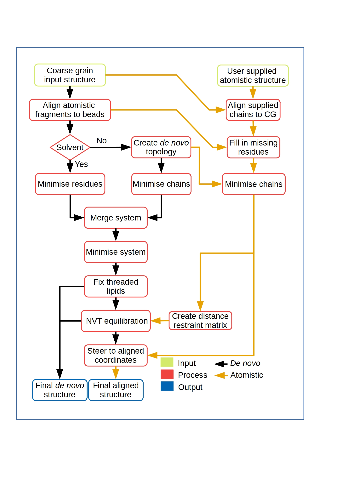
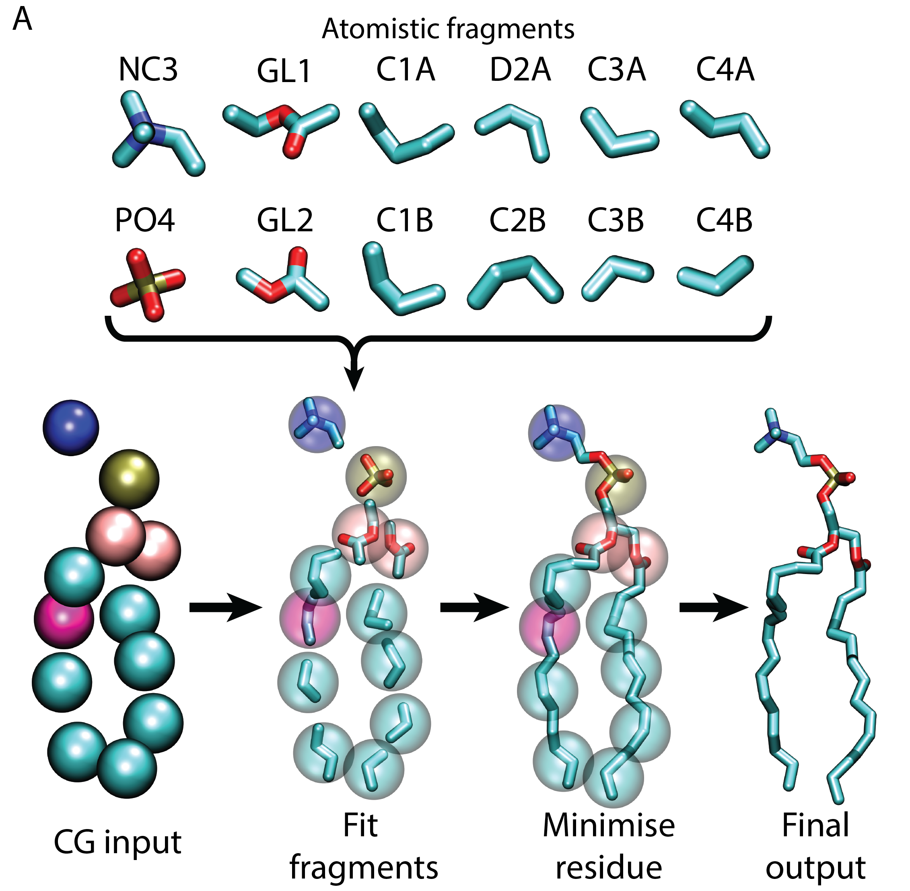
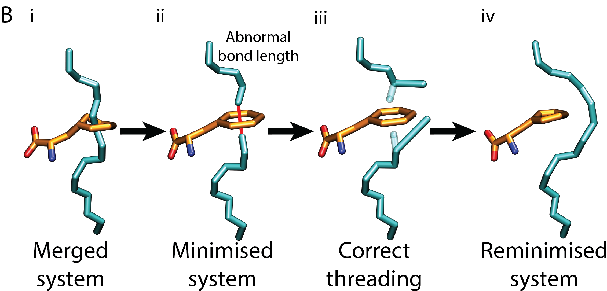
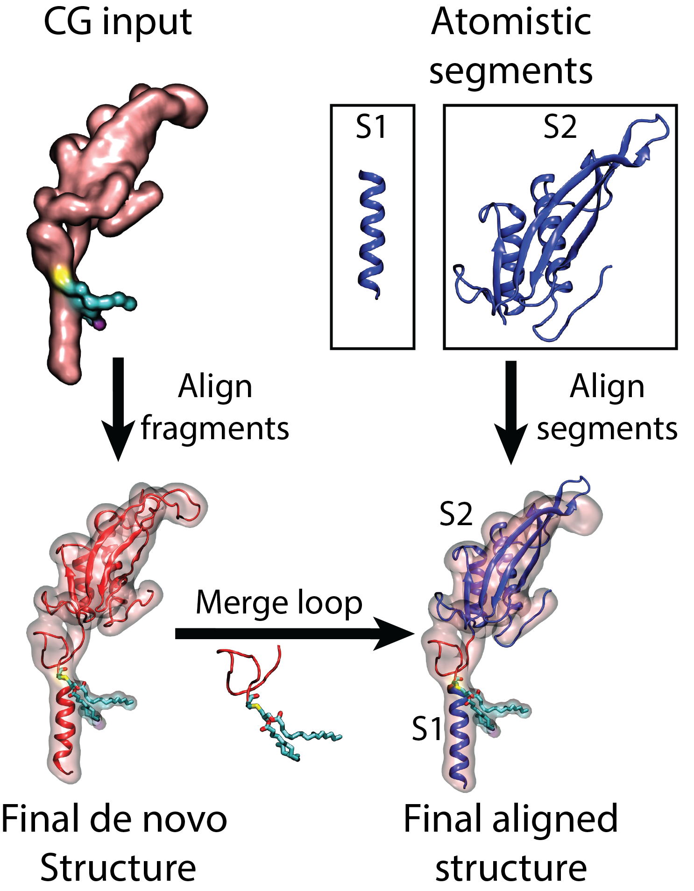
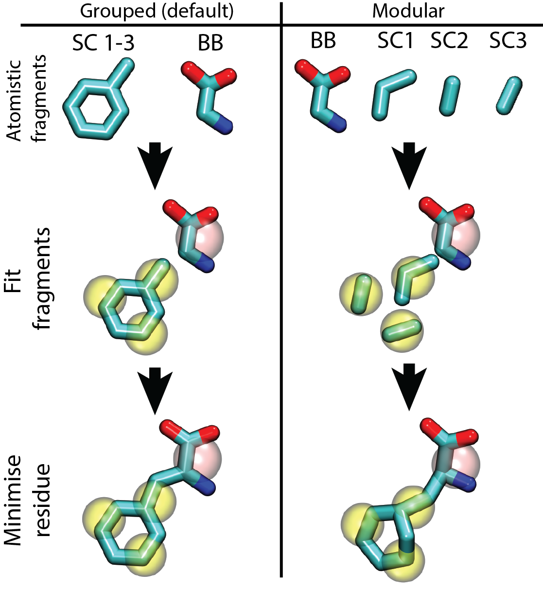

# CG2AT2 — Lite Version

> **Citation:** Vickery ON, Stansfeld PJ. *CG2AT2: an Enhanced Fragment-Based Approach for Serial Multi-scale Molecular Dynamics Simulations.* J Chem Theory Comput. 2021;17(10):6472–6482. [doi:10.1021/acs.jctc.1c00295](https://doi.org/10.1021/acs.jctc.1c00295)

---

## Table of Contents

1. [Overview](#overview)
2. [Installation](#installation)
3. [Requirements](#requirements)
4. [Quick Start](#quick-start)
5. [Flags Reference](#flags-reference)
6. [How It Works](#how-it-works)
7. [Input](#input)
8. [Output Structure](#output-structure)
9. [Output Conversion Modes](#output-conversion-modes)
10. [Detailed Flag Guide](#detailed-flag-guide)
11. [Database Structure](#database-structure)
12. [Adding Fragments to the Database](#adding-fragments-to-the-database)

---

## Overview

CG2AT2 converts Coarse-Grained (CG) molecular systems (e.g. Martini) back to atomistic resolution using a **fragment-based fitting** approach. It is designed to require minimal input from the user — in most cases only the CG coordinate file and the original atomistic protein structure are needed, and CG2AT2 produces all files required to run further atomistic simulations.

<p align="center">
  
</p>

---

## Installation

CG2AT2 requires no compilation. Download it directly from GitHub and run it immediately.

**Recommended:** add CG2AT2 to your `PATH` for convenience by appending the following to your `~/.profile` or `~/.bashrc`:

```bash
export PATH="/path/to/CG2AT2:$PATH"
```

---

## Requirements

| Category | Requirement |
|---|---|
| Python | v3.0 or higher |
| GROMACS | v5 or higher |
| NumPy | any recent version |
| SciPy | any recent version |

All other dependencies (`argparse`, `copy`, `glob`, `math`, `multiprocessing`, `os`, `pathlib`, `re`, `shutil`, `subprocess`, `sys`, `time`, etc.) are included in the Python standard library.

> **Note:** `distutils` is no longer required as of this release.

---

## Quick Start

**Minimal run** (CG structure only):
```bash
python cg2at.py -c cg_input.gro
```

**Recommended run** (with original atomistic structure for improved quality):
```bash
python cg2at.py -c cg_input.gro -a atomistic_input.gro
```

**Fully automated run** (no interactive prompts):
```bash
python cg2at.py -c cg_input.gro -a atomistic_input.gro \
    -w tip3p -fg martini_2-2_charmm36 -ff charmm36-jul2022
```

---

## Flags Reference

### Required

| Flag | Type | Description |
|---|---|---|
| `-c` | `pdb/gro/tpr` | Coarse-grained input coordinates |

### Optional

| Flag | Type | Default | Description |
|---|---|---|---|
| `-a` | `pdb/gro/tpr` | — | Atomistic input coordinates |
| `-d` | `0:2 1:3` | — | Duplicate atomistic chains (chain:copies) |
| `-loc` | `str` | `CG2AT_<timestamp>` | Output folder name |
| `-o` | `all/align/de_novo/none` | `all` | Output conversion mode |
| `-group` | `0,1 2,3 / all / chain` | — | Rigid-body fitting groups |
| `-ncpus` | `int` | 8 (or max) | Number of CPU cores |
| `-mod` | flag | off | Treat fragments individually (disable grouping) |
| `-sf` | `float` | `0.9` | Fragment scale factor before fitting |
| `-cys` | `float` | `7.0` | Disulphide bond search cutoff (Å) |
| `-ter` | flag | off | Interactively choose terminal species |
| `-nt` | flag | off | Neutral N-terminus on all chains |
| `-ct` | flag | off | Neutral C-terminus on all chains |
| `-vs` | flag | off | Apply virtual sites to protein |
| `-swap` | `str` | — | Swap residues or beads during conversion |
| `-box` | `float float float` | — | New box dimensions in Å (0 = keep original) |
| `-w` | `str` | — | Water model (e.g. `tip3p`, `spce`) |
| `-ff` | `str` | — | Force field (e.g. `charmm36-jul2022`) |
| `-fg` | `str` | — | Fragment library (e.g. `martini_2-2_charmm36`) |
| `-gmx` | `str` | `gmx` | GROMACS executable name |
| `-messy` | flag | off | Keep all temporary files |
| `-silent` | flag | off | Auto-accept disulphide bond suggestions |
| `-disre` | flag | off | Disable backbone distance restraint matrix |
| `-ov` | `float` | `0.3` | Minimum allowed atom overlap (Å) |
| `-posre` | `str` | — | Generate position restraint file for a residue |
| `-compare` | `str` | — | Compare an `.itp` file against the database |
| `-info` | flag | off | Print available force fields and fragments |
| `-version` | flag | off | Print CG2AT2 version |
| `-v` | flag (stackable) | off | Increase output verbosity (up to `-vvv`) |
| `-h` | flag | — | Show help and exit |

---

## How It Works

CG2AT2 uses a **fragment-based fitting** workflow. Each fragment is placed and rotated independently with no knowledge of neighbouring beads:

<p align="center">
  
</p>

1. **Centre** each fragment at the centre of mass (COM) of its heavy atoms.
2. **Rotate** the fragment to minimise the distance between atoms that connect to adjacent beads.
3. **Minimise** each residue individually.
4. **Merge** all residues and minimise the complete system.
5. **Check** for threaded lipids (bonds > 0.2 nm) and correct them.
6. **Run NVT** equilibration (where applicable).
7. **Morph** the protein to the user-supplied atomistic structure via steered MD (where applicable).

### Threaded Lipid Correction

Lipid tails can accidentally thread through aromatic residues during CG-to-AT conversion. CG2AT2 detects this by checking all bond lengths in the minimised system. Any bond exceeding 0.2 nm is treated as a threading event — the offending atoms are corrected and the system is re-minimised.

<p align="center">
  
</p>

---

## Input

CG2AT2 supports two rebuilding strategies:

- **De novo:** Fragments are fitted to the CG bead positions from scratch.
- **Flexible fitting:** A user-supplied atomistic structure is sequence-aligned to the CG system and then morphed into place via steered MD. This produces the highest quality output and should be used whenever the original atomistic structure is available.

If only a partial atomistic structure is supplied (e.g. the main protein but not a flexible linker), CG2AT2 uses the de novo method to build in the missing regions and seamlessly combines the two.

<p align="center">
  
</p>

Multiple atomistic input files are accepted:
```bash
python cg2at.py -c cg_input.gro -a chain_A.pdb chain_B.pdb
```

---

## Output Structure

```
CG2AT_<timestamp>/
├── INPUT/
│   ├── CG_INPUT.pdb          # CG structure converted to PDB
│   ├── AT_INPUT_X.pdb        # Supplied atomistic structure(s) as PDB
│   └── script_inputs.dat     # All flags used, saved for reproducibility
│
├── <RESIDUE_TYPE>/           # One folder per residue type (e.g. PROTEIN, POPE)
│   ├── *.pdb                 # Individually converted residues
│   ├── *.top / *.itp         # Residue topologies
│   ├── *.mdp                 # Minimisation run files
│   ├── gromacs_outputs       # Full GROMACS log
│   └── MIN/                  # Minimised residue PDBs
│
├── MERGED/
│   ├── merged_cg2at_*.pdb    # All residue types merged into one PDB
│   ├── *.top / *.itp         # Combined topology
│   ├── MIN/                  # Merged minimisation files
│   ├── NVT/                  # NVT equilibration files
│   └── STEER/                # Steered MD alignment files
│
└── FINAL/
    ├── <forcefield>.ff/      # Force field directory
    ├── *.top / *.itp         # Final topology files
    ├── final_cg2at_de_novo.pdb     # De novo output
    ├── final_cg2at_aligned.pdb     # Aligned output (if applicable)
    ├── script_timings.dat    # Per-stage runtime breakdown
    └── RMSD data             # RMSD between CG and atomistic output
```

---

## Output Conversion Modes

Select the output mode with `-o`. The default is `all`.

| Mode | NVT | Steered MD | Output file(s) |
|---|:---:|:---:|---|
| `none` | ✗ | ✗ | `final_cg2at_de_novo.pdb` |
| `de_novo` | ✓ (5 ps) | ✗ | `final_cg2at_de_novo.pdb` |
| `align` | ✗ | ✓ | `final_cg2at_aligned.pdb` |
| `all` | ✓ (5 ps) | ✓ | both of the above |

All modes start with fragment fitting, minimisation, and threaded-lipid correction.

---

## Detailed Flag Guide

### Disulphide Bonds

CG2AT2 searches for disulphide bonds in both the user atomistic structure (S–S < 2.1 Å) and the CG representation (SC1–SC1 < 7 Å, more than 4 residues apart). When a bond is found only in the CG structure it will prompt for confirmation.

```bash
-silent          # Auto-accept all disulphide suggestions without prompting
-cys 10.0        # Expand search radius to 10 Å for stretched martini bonds
```

If you see a topology/atom-count mismatch that is off by exactly 2, it is almost always an undetected disulphide bond — try increasing `-cys`.

---

### Residue and Bead Swapping

The `-swap` flag allows simple mutations or residue substitutions during conversion, without editing the input file. The general syntax is:

```
-swap FROM_residue,bead:TO_residue,bead:resid_range
```

| Use case | Example |
|---|---|
| Swap all ASP to ASN | `-swap ASP:ASN` |
| Swap ASP to ASN in resid range 0–10 and 30–40 | `-swap ASP:ASN:0-10,30-40` |
| Swap residues with different bead names | `-swap POPC,NC3:POPG,GL0` |
| Swap beads within the same residue | `-swap POPG,D2B:POPG,C2B` |
| Skip a bead | `-swap GLU,SC2:ASP,skip` |
| Skip an entire residue | `-swap POPG:skip` |
| Multiple swaps at once | `-swap POPE,NH3:POPG,GL0 POPG,GL0:POPE,NH3` |
| Skip specific NA+ ions by resid | `-swap NA+:skip:4000-4100` |

**Correcting residue name truncation:** PDB and GRO formats truncate residue names to four characters, which causes ambiguity with closely related residues such as phosphoinositides. CG2AT2 internally supports longer names. For example, the three PI headgroup variants are stored as `POPI1_3`, `POPI1_4`, and `POPI1_5`, and a four-character `POPI` bead in the input can be redirected:

```bash
-swap POPI:POPI1_4
```

---

### Protein Chain Fitting

For multimeric proteins, CG2AT2 offers several rigid-body fitting strategies:

```bash
# Default: fit each atomistic chain to its CG counterpart independently
python cg2at.py -c cg.gro -a protein.pdb

# Fit by CG chain (one group per CG chain)
python cg2at.py -c cg.gro -a protein.pdb -group chain

# Fit the entire atomistic structure as a single rigid body
python cg2at.py -c cg.gro -a protein.pdb -group all

# Fit specific chains as groups (chains 0+2 together, chains 1+3 together)
python cg2at.py -c cg.gro -a protein.pdb -group 0,2 1,3
```

---

### Chain Duplication

For homomeric complexes only one chain needs to be supplied; the `-d` flag copies it:

```bash
# Use 3 copies of chain 0 and 2 copies of chain 1
python cg2at.py -c cg.gro -a monomer.pdb -d 0:3 1:2
```

---

### Terminal Residues

CG2AT2 uses charged termini by default (most force fields require this). Override with:

```bash
-nt       # Neutral N-terminus on all chains
-ct       # Neutral C-terminus on all chains
-ter      # Interactive selection per chain
```

---

### Fragment Scale Factor

Fragments are shrunk to 90% of their original size before fitting, reducing atom clashes. Decrease further if minimisation fails:

```bash
-sf 0.8   # Shrink to 80%
```

---

### Fragment Grouping

By default, adjacent beads within a residue are fitted as a group, improving geometry (especially for sugars). To disable:

```bash
-mod      # Treat every bead fragment independently
```

<p align="center">
  
</p>

---

### PBC Box Resizing

Box resizing is currently supported for **cubic boxes only**. Dimensions are in Ångströms; use `0` to preserve the original value on a given axis:

```bash
-box 100 100 100    # Set all axes to 100 Å
-box 0 0 100        # Shrink only the Z-axis to 100 Å
```

---

### Distance Restraint Matrix

When an atomistic structure is supplied, CG2AT2 generates a backbone hydrogen-bond distance restraint matrix that is applied during NVT. This refines backbone atom orientations with minimal effect on overall structure. Disable with:

```bash
-disre
```

---

### Atom Overlap Checker

Atoms closer than 0.3 Å will cause minimisation to fail. Increase the cutoff if needed:

```bash
-ov 0.5   # Allow up to 0.5 Å overlap
```

---

### Resuming a Failed Run

CG2AT2 skips any step for which output files already exist, so a failed run can be resumed after fixing the error simply by re-running the same command with the same `-loc` directory:

```bash
-loc CG2AT   # Use a fixed directory name instead of a timestamp
```

---

### Miscellaneous

```bash
-gmx gmx_mod     # Use a specific GROMACS binary
-messy           # Keep all temporary files
-vs              # Apply virtual sites to protein hydrogen atoms
-ncpus 4         # Limit to 4 CPU cores (default: 8 or system max)
-v / -vv / -vvv  # Increase verbosity
-info            # List available force fields and fragment libraries
-info -fg martini_2-2_charmm36   # List residues in a specific library
-posre POPE      # Generate a position restraint file for POPE
-compare martini_v3.itp   # Compare an itp against the database
```

---

## Database Structure

```
database/
├── forcefields/
│   └── charmm36.ff/          # Standard GROMACS force field directory
│
└── fragments/
    └── <forcefield_type>/    # e.g. martini_2-2_charmm36
        ├── protein/
        │   └── <AA>/         # e.g. ASP, PHE
        │       ├── <AA>.pdb  # Fragment (bead sections)
        │       └── <AA>.top  # Topology (optional)
        ├── protein_modified/
        │   └── <residue>/    # e.g. CYSD
        ├── non_protein/
        │   └── <residue>/    # e.g. POPC
        │       ├── <RES>.pdb
        │       ├── <RES>.itp
        │       └── <RES>.top (optional)
        ├── solvent/
        │   └── <bead>/       # e.g. W
        │       └── TIP3P.pdb, SPCE.pdb, ...
        ├── ions/
        │   └── <ion>/        # e.g. NA+
        └── other/
            └── <residue>/    # e.g. DA (DNA)
```

> **Tip:** Prefix any file or folder name with `_` to prevent CG2AT2 from reading it.

---

## Adding Fragments to the Database

### Fragment PDB Format

Each fragment PDB uses `[ bead_name ]` section headers followed by standard `ATOM` records:

```pdb
[ BB ]
ATOM      1  N   PHE     1      42.030  16.760  10.920  2.00  0.00           N
ATOM      2  CA  PHE     1      42.770  17.920  11.410  3.00  1.00           C
ATOM     10  C   PHE     1      44.240  17.600  11.550  2.00  0.00           C
ATOM     11  O   PHE     1      44.640  16.530  12.080  6.00  0.00           O
[ SC1 ]
ATOM      3  CB  PHE     1      42.220  18.360  12.800  1.00  1.00           C
...
```

- **Protein amino acids** should *not* include adjustable hydrogens — these are added automatically by `pdb2gmx`.
- **Modified protein and non-protein** fragments *should* include all hydrogens, as they are not processed by `pdb2gmx`.

### Optional Topology File

A `.top` file of the same name can provide connectivity, grouping, chirality, and hydration information:

```
[ CONNECT ]
# bead_1  atom_1  bead_2  direction
   BB       N      BB        -1
   BB       C      BB         1

[ GROUPS ]
SC1 SC2 SC3

[ CHIRAL ]
# central  move  atom1  atom2  atom3
   CA       HA    CB     N      C

[ HYDRATION ]
W
```

### Solvent Fragments

Each solvent model is a separate PDB file inside the bead folder (e.g. `solvent/W/TIP3P.pdb`). A single CG water bead can expand to multiple atomistic molecules:

```pdb
[ TIP3P ]
ATOM      1  OW  SOL     1      20.910  21.130  75.300  1.00  0.00
ATOM      2  HW1 SOL     1      20.580  21.660  76.020  1.00  0.00
ATOM      3  HW2 SOL     1      21.640  21.640  74.940  1.00  0.00
ATOM      4  OW  SOL     2      21.000  22.960  77.110  1.00  0.00
...
```

### Ion Fragments

Each ion is stored as a single-atom fragment. The `[ HYDRATION ]` topology entry controls which solvent bead is overlaid to model the first hydration shell:

```pdb
[ NA+ ]
ATOM      1  NA   NA     1      21.863  22.075  76.118  1.00  0.00
```

```
[ HYDRATION ]
W
```

### Generating Position Restraint Files

CG2AT2 can generate a position restraint `.itp` for any non-protein residue in the database:

```bash
python cg2at.py -posre POPE -fg martini_2-2_charmm36
```

This creates `POPE_posre.itp` and adds the corresponding `#ifdef NP` block to the residue's `.itp` file.
